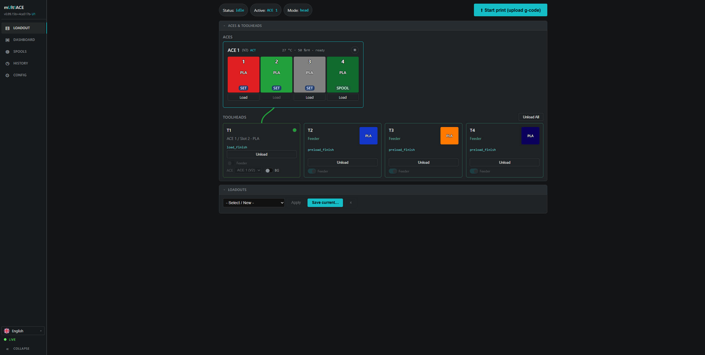
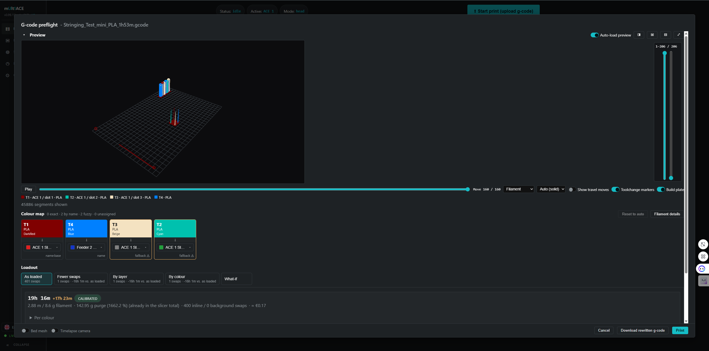
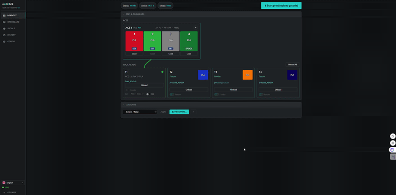

# multiACE

> This is a personal fork of [decay71/multiACE](https://github.com/decay71/multiACE). For the project's full README — what it is, features, installation, hardware setup, configuration, and everything else not covered below — see the upstream repo. This README only tracks what's changed in this fork.

## Known issues

- The camera feed in the Dashboard tab isn't working.
- Starting the ACE 2 Pro dryer directly above 50 °C can trigger a `ptc_error` in the ACE firmware, requiring a power cycle. Firmware limitation, hit by automatic humidity control whenever it restarts the heater at a stored higher target. Next release works around it with a soft ramp (50 °C, then raise to target after a few minutes).
- Per-pair purge in the Web UI shows as unchecked even when active. Enable via `ACE_SET_PURGE MATRIX=1` in the Fluidd console; WebUI fix planned.

## What's new in 0.99.16b "Second Take" (since 0.99.15b)

- **Reprint from history** — reprint a file exactly as it's already staged on the printer, no preflight or rewrite re-run, from the print history.
- **Print queue** — stage a rewritten gcode file without starting it, then launch or delete it later from a new Queue panel instead of only ever printing immediately after preflight.
- **Remember last filament** (on by default, Config tab) — pulling a bare, non-RFID filament from a slot keeps its manually assigned color/material and spool-library link in place and offers it back the next time something is inserted there, instead of clearing it. A freshly read RFID chip always takes priority over a remembered label.
- **Large uploads no longer look frozen** — both the browser-direct and server-side upload paths now stream the gcode file straight from disk instead of buffering it whole first, and the preflight progress bar shows a live percent/ETA during upload instead of sitting on one number for however long the transfer takes.
- Oversized preflight uploads are now rejected off the Content-Length header before the body is read, instead of buffering the whole (too-large) file first — reads to the user as a fast "too large" error instead of a stuck "Analyzing G-code..." dialog. nginx and the upload timeout were tuned to match (streamed through instead of spooled, longer read/write allowance for slow LAN transfers of large files).
- Added WebRTC as a webcam source option alongside the existing MJPEG stream.

## What's new in 0.99.15b "Clean Sweep" (since 0.99.14b)

- **Combo (ACE + feeder) mode fully stripped out for now**, not just gated off — the per-head feeder-park-length setting, the `_ace_present` non-connected-ACE guard, and the associated config/UI/tests are removed rather than left dormant. Will come back together once the underlying spool-tracking bug is fixed.
- **Per-ACE, per-slot, and per-feeder config overrides removed** — dryer temp/duration, feed/retract speed, and load/retract/swap-retract lengths are global-only now (Config tab). Simpler config surface, fewer combinations to reason about.
- Reverted the PLA tip-forming choreography and snapped-tip purge recovery added alongside combo mode back to a plain temperature-only tip form; they weren't reliable enough to keep in this cut.
- **Start-print CTA moved to the Loadout tab** (where a session actually starts), with the Dashboard-tab button kept only as a fallback for plain-printer setups with no Loadout tab.
- The swap-cost estimate no longer goes silent for a tool with no spool price bound — it's now priced at a flagged default (€20/kg) so the headline total stays a real estimate instead of omitting that tool.
- Fixed the browser-side (Pyodide) preflight estimate using stale cost params/calibration from whenever the tab was opened instead of the printer's current Settings.

## What's new in 0.99.14b "True Estimate" (since 0.99.13b)

> **Combo mode is temporarily disabled** while a spool-tracking bug is worked out (assigning a spool to a head sourced from its feeder tap silently failed to book usage instead of erroring). Disabled at the source — config load, persisted-state restore, and `ACE_SET_HEAD_FEEDER_COMBO ENABLE=1` all refuse to turn it on, and the checkbox is hidden in the web UI. Two related fixes landed anyway, kept for when combo mode returns: feeder PRELOAD on a combo head now stops at the Y-splitter instead of the toolhead sensor, and a bare `FEED_AUTO LOAD=1` now checks the feeder inlet sensor to resolve the source instead of guessing.

- **Live estimate recompute on edit** — editing a filament mapping or head assignment in the browser-side (Pyodide) preflight now recomputes the time/cost estimate and timeline immediately, instead of leaving stale numbers from the original mapping. The server-fallback preflight still shows the original mapping's estimate.

## What's new in 0.99.13b "Twin Feed" (since 0.99.8b)

Covers everything merged across 0.99.9b–0.99.13b. (0.99.11b was pulled for instability.)

**Hybrid combo heads (ACE + stock feeder on one head)**
- A head can run **both** its ACE slots and its stock feeder spool on the same path via a Y-splitter, swapping between them mid-print for up to `slots + 1` colours on that head (`ACE_LOAD_HEAD`/`ACE_SWAP_HEAD ... SOURCE=FEEDER`).
- Detects and loads stock feeder filament on combo heads; shows combo feeder-tap heads in the embedded Fluidd panel.
- Fixed a boot-crash when restoring a combo head's feeder-tap source across a Klipper restart, and guarded combo/ACE heads wired to a non-connected ACE unit instead of erroring.
- Various combo-head UI fixes (tile visibility/positioning, gear-icon overlap, collapsible config info, `ACE_SET_HEAD_FEEDER_COMBO` no longer refusing to disable a tap in use).

**Unload reliability — blob / snapped-tip hardening**
- Real per-material PLA tip-forming choreography with a cooling step, producing a short, tapered tip instead of the long stringy pull that snaps and strands a fragment at the head.
- Snapped-tip recovery: the extruder now purges out a stranded fragment instead of failing the unload.
- Hot re-unload retries now honor the configured unload temperature instead of creeping hotter.

**Config & dashboard UX**
- Config override fields show the effective inherited default as a placeholder.
- Dashboard restart buttons, plus a sidebar padding fix.
- The virtual loadout overlay now persists server-side.

**Fixes & infrastructure**
- Fixed `FLOW_RESET_K` crashing Klipper on every boot.
- SSH key bootstrap mode for developer pushes; fixed CRLF corruption in remote push commands.
- Fixed the ARM64 cross-compile Docker build (QEMU emulation).
- Release-bin workflow, head-mode developer support, and internal test/mock-fixture improvements.

## What's new in 0.99.8b "Resupply Run"

- **Quad Replenish (ACE Refill)** — when a spool runs out mid-print, multiACE loads a matching spool from another ACE/slot and continues.
- **Spool management** — tracks material, colour, vendor and remaining weight per slot; consumption is booked automatically while printing. Spools can be assigned manually or from an RFID tag, and synced with Spoolman or SpoolLink.
- **Humidity-controlled drying** — an ACE 2 regulates its dryer from its own humidity reading, and takes any connected ACE Pro along (which can't measure humidity itself).
- **Per-pair purge** — flush volume now comes from the slicer's flush matrix instead of one fixed length for every colour pair.
- **Air Print Detection** — watches the flow sensor during loading and printing to catch filament that's present but not actually extruding.
- **Firmware flash** — ACE 2 firmware updates from the web UI, down from ~30 minutes to ~10 seconds (flash engine based on hakimio's OTA updater, used with permission).
- Updated compact panel view for embedding ACE status in Fluidd as a cam.
- Custom temp/tip-forming profiles, parallel preload, pickup-cleaning, parked-position background swaps (experimental, head mode only), and Firmware 1.5.2 detection/support.

## Features

- **In-print colour swaps** — layer-boundary or mid-layer, from slicer G-code or the post-processing script
- **Full cross-ACE feed-assist** — every head, every connected ACE, at stock toolchange speed
- **Hardened load/unload** — retract-recovery between retries, pause-state snapshot on failure, safer resume (pre-heat before travel, Z-hop before XY)
- **Per-ACE feed-assist / load toggles** — disable independently for print-time and load-time
- **Automatic load retry** — a failed toolhead load retries itself before pausing the print
- **RFID handling** — automatic detection and display across ACE switches; manual (non-RFID) spools supported too
- **Per-ACE dryer settings**, ACE switching via Fluidd macros or console, auto-load/unload-all
- **Normal Mode** — instantly fall back to stock Snapmaker operation (e.g. for TPU/TPE)
- **PAXX firmware compatible**, with an integrated installer
- **Clean install/uninstall** — one-command scripts with automatic backup/restore
- **Reactive Web UI** at `/multiace/` — live dashboard, webcam + console pane, editable job queue, saveable loadouts, apply-changes diffing, live retry banner, multi-language (EN/DE/ZH)
- **Web Preflight** — upload raw G-code, reorder by loaded spools or an optimized layout to minimize swaps, with spools autoloaded on demand
- **On-printer touchscreen (community)** — [physicsG's HelixScreen fork](https://github.com/physicsG/helixscreen) adds multiACE support to [HelixScreen](https://github.com/prestonbrown/helixscreen)

See it in action: https://youtu.be/9uLE1uydWmo

## Tabs in action

| Loadout tab | Preflight tab |
|---|---|
|  |  |
| Assign slots to toolheads, load/unload, and save/apply loadouts. | Upload G-code, map colours to loaded spools, and preview the estimated swaps, time, and cost before printing. |
|  |  |

## ACE Pro 2 support

Up to 4 units, or mixed with ACE Pro (V1) units — 4 total regardless of type. Requires ACE Pro 2 firmware **1.1.31**.

- Update script (use at your own risk): https://gist.github.com/hakimio/39c71fa7174e699c6470b7c79323b189 (thanks to hakimio)
- Firmware: https://drive.google.com/file/d/1SUnXyiJ28iv01P94k4XbRpL4bjl3HbdU/view?usp=sharing
- Background: https://github.com/BlackFrogKok/SnapAce/issues/7

## Supported firmware

| Firmware | Device | Status | Known issues |
|----------|--------|--------|--------------|
| 1.5.2 | Snapmaker U1 | **supported** (reference version) | none |
| 1.5.1 | Snapmaker U1 | supported | RFID identity can lag a slot insert by a few seconds |
| 1.5.0 | Snapmaker U1 | supported | RFID identity can lag a slot insert by a few seconds |
| 1.4.x | Snapmaker U1 | unsupported | old ACE protocol — slot/RFID fields differ |
| 1.1.31 | ACE Pro 2 | supported | none |

multiACE detects the firmware version (from Moonraker, or `firmware_version:` in `[ace]`) and shows it in the Config tab; an untested version is reported as such rather than blocked. Table source: [`multiace/firmware_compat.py`](multiace/firmware_compat.py) (`GET /api/version`).

## Getting started

Requirements: a Snapmaker U1 (Snapmaker or PAXX firmware), 1–4 Anycubic ACE Pro units on USB, SSH access, Fluidd, and a PTFE splitter per toolhead.

The standard manual install (SCP the `multiace/` folder, run `install_multiace.sh`), hardware wiring, the full `ace.cfg` reference, in-print swap setup, and troubleshooting are all unchanged in this fork — see [decay71/multiACE](https://github.com/decay71/multiACE) or the [guide site](https://postapocalyptic-diy.com/multiace/) for those.

### Installing or updating this fork specifically

This fork publishes its own builds, separate from decay71's releases:

- **Prebuilt firmware `.bin`** — every push to `main` that bumps `multiace/VERSION` triggers [`release-bin.yml`](.github/workflows/release-bin.yml), which builds the PAXX overlay and publishes a flashable `.bin` (plus checksums and the overlay tarball) to this repo's [Releases](https://github.com/stefanodangelo/multiACE/releases). Flash it from the printer's own update screen, the same as any PAXX firmware update.
- **Pushing a working tree to a live printer** (for development) — `scripts/push-to-printer.sh` / `.ps1` install the code you have right now instead of a published release:
  - `--web-only` (default) — syncs `multiace/web/` only and restarts the panel service. Never touches Klipper; worst case is a broken web page.
  - `--full` — syncs everything and runs `install_multiace.sh`, replacing the stock Klipper files and patching `TRSYNC_TIMEOUT` in `mcu.py`. Gated on local tests passing, the printer being idle, and `mcu.py` being in a known (stock or already-patched) state.
  - `--rollback` — restores the installer's own pre-multiACE backups and restarts.
  - `--bootstrap-key` — installs an SSH key onto the printer after a reimage, when `authorized_keys` is gone.
  - Also: `--dry-run`, `--no-restart`, `--skip-tests` (with `--full` only), `--force-mid-print` (don't). Run either script with `--help` for the full list.

## License

This is a fork of [decay71/multiACE](https://github.com/decay71/multiACE), itself based on [SnapACE](https://github.com/BlackFrogKok/SnapACE) and [Klipper](https://github.com/Klipper3d/klipper). All are GPL-3.0, and so is this fork.

## AI-assisted development notice

This project includes AI-assisted content (research, documentation, parts of code). All content is reviewed by humans before inclusion.

## Credits

- **[decay71](https://github.com/decay71)** — creator of [multiACE](https://github.com/decay71/multiACE), the project this repo is forked from
- **[hakimio](https://github.com/hakimio)** — ACE Pro 2 reverse engineering, support, and firmware flash
- **[SnapACE](https://github.com/BlackFrogKok/SnapACE)** by BlackFrogKok — foundation for ACE Pro Klipper integration
- **[DuckACE](https://github.com/utkabobr/DuckACE)** — ACE Pro reverse engineering and protocol documentation
- **[ACE Research](https://github.com/printers-for-people/ACEResearch)** by Printers for People — ACE Pro protocol research
- **Snapmaker** — printer hardware and firmware
- **Anycubic** — ACE Pro filament changer
- **Community** — testing, feedback, and bug reports
